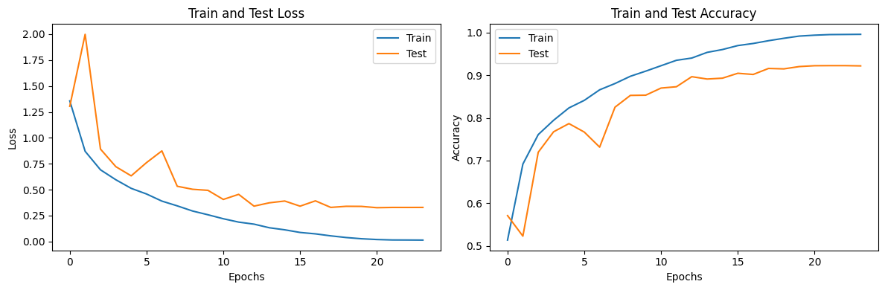

# CIFAR-10 Classification using ResNet

## Model

The model used for CIFAR-10 classification is ResNet (Residual Neural Network). ResNet is a deep convolutional neural network architecture that is known for its ability to train very deep networks by using skip connections or residual connections. The ResNet model used in this project has a total of 18 convolutional layers, including residual blocks with two convolutional layers each. It also includes batch normalization and ReLU activation functions after each convolutional layer. **The model is defined in the `model.py` file.**

## Dependencies

The code requires the following dependencies:

- PyTorch: The deep learning library used for building and training the model.
- Torchvision: A PyTorch package that provides datasets and transforms for computer vision tasks.
- Matplotlib: A plotting library used for visualizing loss and accuracy curves.
- NumPy: A library for numerical computing.
- PIL: The Python Imaging Library used for image processing.

## Data Augmentation

Data augmentation is a technique used to increase the diversity of the training dataset by applying random transformations to the input images. It helps to improve the model's ability to generalize and reduces overfitting. The following data augmentation strategies were used:

- Random Crop: Randomly crops the image to a smaller size while preserving the aspect ratio.
- Random Horizontal Flip: Randomly flips the image horizontally.
- Normalization: Normalizes the image by subtracting the mean and dividing by the standard deviation of the dataset.

Additionally, a custom `Cutout` transform is applied, which randomly cuts out a square region from the images. This technique encourages the model to focus on smaller local features and improves its robustness to occlusions.

In the code, a custom `Cutout` transform is applied to the training images. Here's how it works:

1. For each image, a random position `(x, y)` within the image is selected as the top-left corner of the cutout patch.
2. The length of the side of the cutout patch is also chosen randomly.
3. The pixels within the selected rectangular region `(x, y, x + length, y + length)` are set to zero, effectively "cutting out" that portion of the image.
4. The resulting image with the cutout patch is then used for training.
   
By randomly removing these patches from the images, the model is forced to rely on other features in the remaining parts of the image, thereby making it more robust to occlusions and improving its generalization capabilities.

## Learning Rate Finder

The learning rate (LR) finder is a technique used to determine an optimal learning rate for training a neural network. It helps identify the learning rate range where the model achieves the fastest convergence and the lowest loss. Here are some pros and cons of using the LR Finder:

## OneCycleLR Policy

The purpose of the OneCycleLR policy is to dynamically adjust the learning rate during training to improve model performance. It is designed to achieve faster convergence and better generalization by using a cyclical learning rate schedule.

### Phases of OneCycleLR Policy

The OneCycleLR policy consists of two phases: the increasing phase and the decreasing phase.

1. **Increasing Phase:** During this phase, the learning rate is gradually increased from `min_lr` to `max_lr`. This helps the model quickly converge to a good solution by using a higher learning rate.

2. **Decreasing Phase:** In this phase, the learning rate is gradually decreased back to `min_lr`, allowing the model to fine-tune and stabilize the learned weights.

By incorporating these two phases, the OneCycleLR policy helps the model to effectively explore the learning rate landscape and find an optimal rate for training.

### Dynamic Learning Rate Adjustment

Using the OneCycleLR policy, you can set the `max_lr` and `min_lr` values to define the upper and lower bounds of the learning rate range. However, the actual learning rate used during training will be dynamically adjusted by the scheduler based on the current epoch and step within the epoch.

This means that even though you manually set the `max_lr` and `min_lr` values, the OneCycleLR policy will still adjust the learning rate within that range according to its cyclical pattern. This allows the model to explore different learning rates and find a better balance between convergence speed and generalization performance.

The OneCycleLR policy is a powerful technique to enhance the training process, especially when combined with other regularization methods, and it can lead to improved performance and faster training convergence.

Pros:
- Allows for efficient exploration of a wide range of learning rates.
- Helps find an initial learning rate that can speed up the training process.
- Provides insights into the behavior of the model by visualizing the loss versus learning rate curve.

Cons:
- The LR Finder may not always converge to the global minimum, but it can still provide a good starting point for training.
- It requires an additional pass over the training data, which increases the training time.
- The optimal learning rate found by the LR Finder may vary depending on the model architecture, dataset, and optimization algorithm.

In this code, the LR Finder is used to determine the learning rate range for training the ResNet model. The `LRFinder` class from the `torch_lr_finder` package is utilized. The LR Finder iterates through the training data while gradually increasing the learning rate and records the corresponding losses. The learning rate range is then visualized using a plot.

## Model Parameters & Receptive Field

- Number of epochs: 24
- Batch size: 512

The model's parameters were optimized using the Adam optimizer with a learning rate range obtained from the LR Finder. The learning rate was adjusted using the OneCycleLR scheduler.

The receptive field of a neural network refers to the region of the input image that influences the output of a particular neuron. In this ResNet model, the receptive field increases gradually with the depth of the network due to the stacking of convolutional layers and the use of residual connections.

The ResNet model used in this project consists of multiple residual blocks. Each residual block contains several convolutional layers, batch normalization layers, and ReLU activation functions. The number of filters in each convolutional layer and the size of the receptive field increase as we go deeper into the network. The detailed model architecture and the receptive field size for each layer are as follows:

| Layer                  | Output Size    | Receptive Field | Parameters  |
|------------------------|----------------|-----------------|-------------|
| Input                  | 32x32x3        | -               | -           |
| Convolution 1          | 32x32x64       | 3x3             | 1,792       |
| Residual Block 1       | 32x32x64       | 3x3             | -           |
| Convolution 2          | 32x32x64       | 3x3             | 36,928      |
| Convolution 3          | 32x32x64       | 3x3             | 36,928      |
| Residual Block 2       | 16x16x128      | 5x5             | -           |
| Convolution 4          | 16x16x128      | 3x3             | 147,584     |
| Convolution 5          | 16x16x128      | 3x3             | 295,040     |
| Residual Block 3       | 8x8x256        | 9x9             | -           |
| Convolution 6          | 8x8x256        | 3x3             | 590,080     |
| Convolution 7          | 8x8x256        | 3x3             | 1,180,160   |
| Residual Block 4       | 4x4x512        | 17x17           | -           |
| Convolution 8          | 4x4x512        | 3x3             | 2,359,808   |
| Convolution 9          | 4x4x512        | 3x3             | 2,359,808   |
| Average Pooling        | 1x1x512        | 32x32           | -           |
| Fully Connected (Output)| 10             | -               | 5,130       |

The total number of parameters in the model is 6,574,090.

The model parameters are learned during the training process and are optimized to minimize the loss function.

## Results

The model is trained on the CIFAR-10 dataset, which consists of 50,000 training images and 10,000 test images belonging to 10 different classes. After training the model for a certain number of epochs, the following results are obtained:

- Training Loss: The average loss on the training set.
- Training Accuracy: The accuracy on the training set.
- Test Loss: The average loss on the test set.
- Test Accuracy: The accuracy on the test set.
- Class-wise Accuracy: The accuracy of the model for each class in the test set.

The model achieved the following results on the CIFAR-10 test dataset:

- **Maximum Test Accuracy: 92.35% at Epoch: 22**

## Loss & Accuracy Plots

The following plots show the training and test loss, as well as the training and test accuracy, across the epochs:

