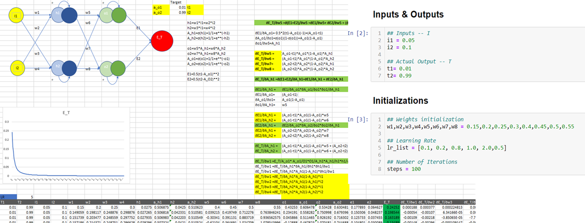
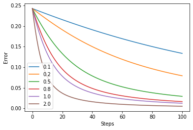

# Part 1, Solution
## Q 1. Rewrite the whole excel sheet showing backpropagation. Explain each major step.
- [Excel Sheet](BackPropagation.xlsx)

## Q 1.a Use exactly the same values for all variables as used in the class


## Q 1.d Major Steps
Below are the defined major steps in this exercise  
   a. Initialization - Weights of the neural network are initialized as : w1 = 0.15, w2 = 0.2, w3 = 0.25, w4 = 0.3, w5 = 0.4, w6 = 0.45, w7 = 0.5, w8 = 0.55  
   b. Utility functions - Sigmoid Activation function  : This is used to squash all the values between 0 and 1  
   c. Forward propagation - Given the weights and inputs this function calculates the predicted output of the netowrk  
   d. Error Calculation - Calculate ```0.5* Squared Error``` between predicted output and target values  
   e. Gradient functions for each weights of the netowrk - These functions calculate the gradients of Error with respect to each weights in the network. This determines the direction and size of step we could take in the direction of minima. Two gradient functions are defined one for each layer. ```gradient_layer1``` function updates the weights that connect the input layer to the hidden layer. ```gradient_layer2``` function updates the weights that connect the hidden layer to output layer.     
   f. Updation of weights - We have incorporated updation of weights for each iteration in a ```for loop```. Each weight is updated by taking only a fraction of step size. The fraction here is defined using learning rate. Higher the learning rate greater the step we take. As a common practice learning rates are in the range between 0 to 1.    
   g. All the above steps are run for different learning rates in a for loop.   

## Q 1.e. Error graph with different learning rate [0.1, 0.2, 0.5, 0.8, 1.0, 2.0] 




Note
- With higher learning rate, we are reaching global minima for the weights faster. (assuming simple problem and the error function will be concave with one only minima)
