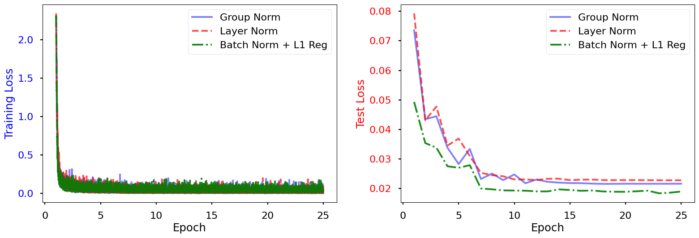
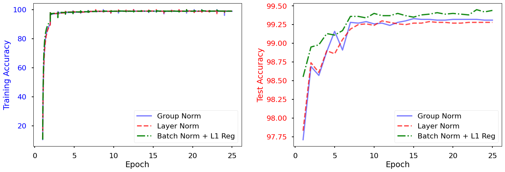
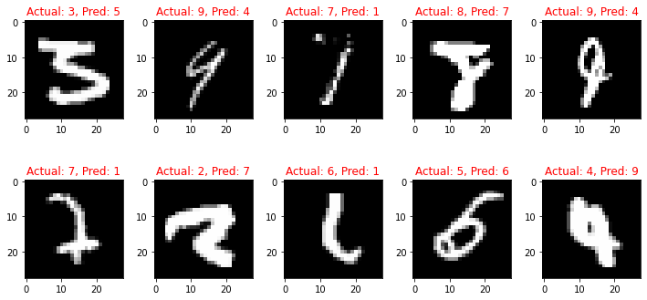
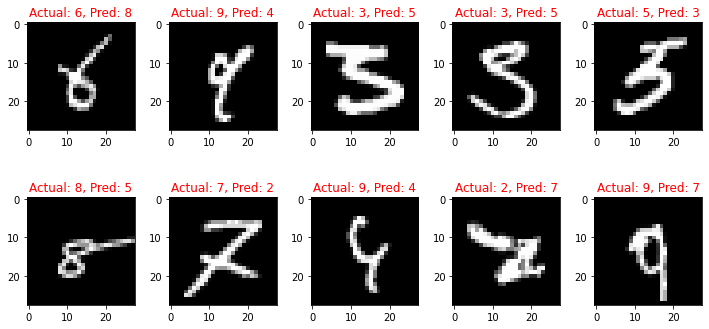

# Solution

## Code Overview

This repository presents a comprehensive study of the impact of various normalization techniques and L1 regularization on a CNN model trained on the MNIST dataset. The code includes the following features:

- Data Loaders: The MNIST dataset is loaded using efficient data loaders.
- Modularized Model: A flexible model architecture is provided, allowing the selection of different normalization techniques such as Batch Normalization (BN), Group Normalization (GN), or Layer Normalization (LN).
- Misclassified Image Plotting: An insightful function is implemented to visualize misclassified images and gain a deeper understanding of the model's performance.
- Training and Test Visualization: Plots are generated to track the training and test loss, as well as accuracy, throughout the training process.

## Experiments

1. Network with Group Normalization
2. Network with Layer Normalization
3. Network with L1 + BN

## Description of Different Normalization Techniques

The image above illustrates the dimensions along which weights are normalized for different normalization techniques.

- **Batch Normalization (BN):** Normalization is performed for each channel over each minibatch.
- **Group Normalization (GN):** Normalization is applied for each group in a split of channels over each image.
- **Layer Normalization (LN):** Normalization is conducted across all channels for each image.

Based on the experimental results, it is observed that Batch Normalization achieves higher test accuracies compared to Group Normalization and Layer Normalization.

## Accuracy & Loss Plots for Training and Test

  

## Misclassified Images

### 1. Network with Group Normalization

### 2. Network with Layer Normalization

### 3. Network with L1 + BN

Please refer to the specific sections above for more detailed information about each experiment, including the code implementation, results, and analysis.
