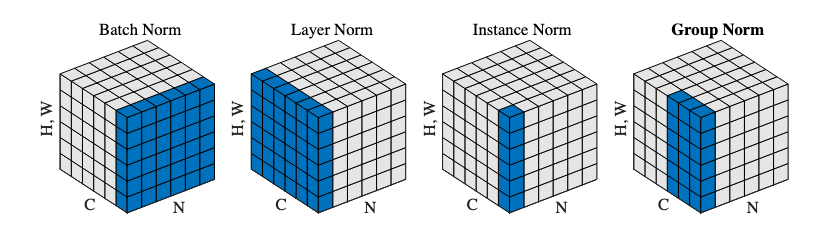
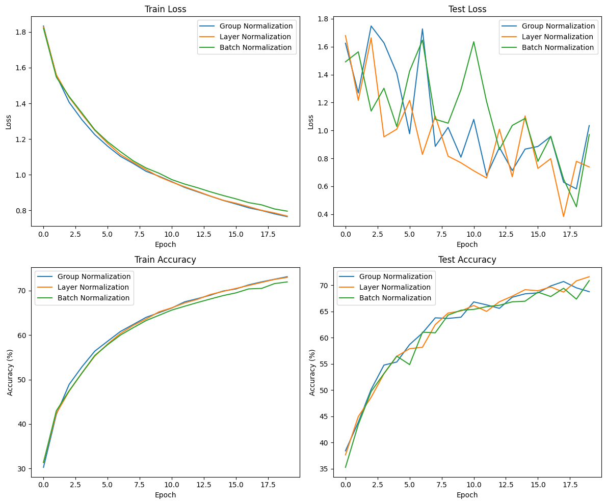
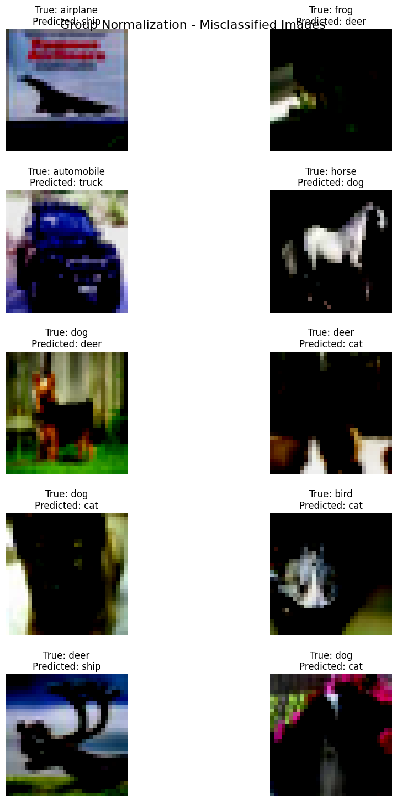
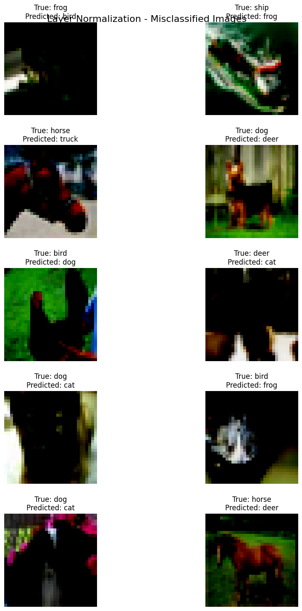
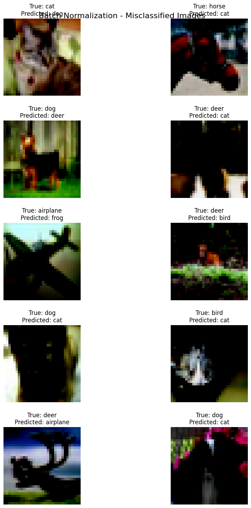

# Solution

## Code Overview

This repository presents a comprehensive study of the impact of various normalization techniques and L1 regularization on a CNN model trained on the CIFAR-10 dataset. The code includes the following features:

- Data Loaders: The CIFAR-10 dataset is loaded using efficient data loaders.
- Modularized Model: A flexible model architecture is provided, allowing the selection of different normalization techniques such as Batch Normalization (BN), Group Normalization (GN), or Layer Normalization (LN).
- Misclassified Image Plotting: An insightful function is implemented to visualize misclassified images and gain a deeper understanding of the model's performance.
- Training and Test Visualization: Plots are generated to track the training and test loss, as well as accuracy, throughout the training process.

## Experiments

1. Network with Group Normalization
2. Network with Layer Normalization
3. Network with Batch Normalization

## Description of Different Normalization Techniques

The image above illustrates the dimensions along which weights are normalized for different normalization techniques.

- **Batch Normalization (BN):** Normalization is performed for each channel over each minibatch.
- **Group Normalization (GN):** Normalization is applied for each group in a split of channels over each image.
- **Layer Normalization (LN):** Normalization is conducted across all channels for each image.

Based on the experimental results, it is observed that Batch Normalization achieves higher test accuracies compared to Group Normalization and Layer Normalization.

## Findings

After training and evaluating the three models with different normalization techniques, the following findings were observed:

## Batch Normalization
Batch Normalization achieved the highest test accuracy among the three models. It effectively reduced the internal covariate shift and improved the training speed and stability. The model with Batch Normalization also showed the fastest convergence during training.

- Batch Normalization model - Max Training Accuracy: 71.96%, Max Test Accuracy: 70.86%

## Group Normalization
Although Group Normalization did not perform as well as Batch Normalization, it still achieved decent test accuracy. This technique divides the channels into groups and normalizes them independently, which helps capture more local statistics. Group Normalization can be useful when the batch size is small or when the batch normalization layer is not applicable.

- Group Normalization model - Max Training Accuracy: 73.13%, Max Test Accuracy: 70.69%

## Layer Normalization
Layer Normalization had the lowest test accuracy among the three models. This technique normalizes the features across the spatial dimensions of each layer, but it does not consider the batch dimension. Layer Normalization may not be as effective in CNNs compared to other normalization techniques, especially when dealing with complex image datasets.

- Layer Normalization model - Max Training Accuracy: 72.98%, Max Test Accuracy: 71.60%

Overall, Batch Normalization remains the most widely used and effective normalization technique for CNNs. It provides improved generalization, faster convergence, and better stability during training. However, the performance of normalization techniques can vary depending on the dataset and model architecture, so it is recommended to experiment and choose the appropriate technique based on the specific requirements and constraints of the task.

**Note:** The findings presented here are specific to the CIFAR-10 dataset and the model architecture used in this study.

## Accuracy & Loss Plots for Training and Test

  

## Misclassified Images

### 1. Network with Group Normalization

### 2. Network with Layer Normalization

### 3. Network with Batch Normalization

Please refer to the specific sections above for more detailed information about each experiment, including the code implementation, results, and analysis.
