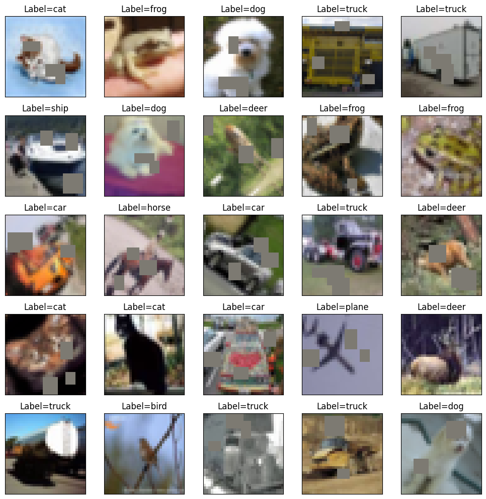
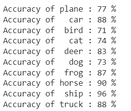
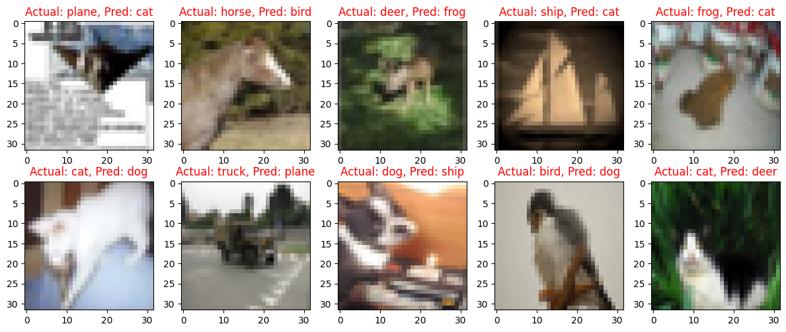

# Assignment: CIFAR10 Classification with CNN and Albumentations

## Problem Statement

1. Change the architecture to C1C2C3C40 (No MaxPooling, but 3 3x3 layers with stride of 2 instead) (If you can figure out how to use Dilated kernels here instead of MP or strided convolution, then 200pts extra!)
2. Total RF must be more than 44
3. one of the layers must use Depthwise Separable Convolution
4. one of the layers must use Dilated Convolution
5. use GAP (compulsory)  - add FC after GAP to target #of classes (optional)
6. use albumentation library and apply:  
        1. horizontal flip
        2. shiftScaleRotate
        3. coarseDropout (max_holes = 1, max_height=16px, max_width=1, min_holes = 1, min_height=16px, min_width=16px, fill_value=(mean of your dataset), mask_fill_value = None)
7. achieve 85% accuracy, as many epochs as you want. Total Params to be less than 200k.
8. make sure you're following code-modularity (else 0 for full assignment)
9. upload to Github
10. Attempt S9-Assignment Solution.  

## Introduction

The goal of this assignment is to design a Convolutional Neural Network (CNN) using PyTorch and the Albumentations library to achieve an accuracy of 85% on the CIFAR10 dataset. The code for this assignment is provided in a Jupyter Notebook, which can be found [here](./ERA1_S9_CIFAR10.ipynb).

The CIFAR10 dataset consists of 60,000 32x32 color training images and 10,000 test images, labeled into 10 classes. The dataset is divided into 50,000 training images and 10,000 validation images.

## Model Architecture

The model architecture used for this assignment is based on the C1C2C3C40 architecture with several modifications. Instead of max pooling, the network consists of 3 convolutional layers with 3x3 filters and a stride of 2. The final layer utilizes global average pooling (GAP). The architecture leverages mobileNetV2, which combines expand, depthwise, and pointwise convolution with residual connections. One layer uses depthwise separable convolution, while another layer uses dilated convolution.

## Data Augmentation

Data augmentation is an essential technique to improve the model's performance and generalization. In this assignment, data augmentation is performed using the Albumentations library. The following techniques are applied in the training data loader:

- Horizontal flipping: Images are horizontally flipped with a certain probability to create additional training samples and introduce more diversity.
- ShiftScaleRotate: Images are randomly shifted, scaled, and rotated to simulate different viewpoints and variations in the dataset.
- CoarseDropout: Random rectangular patches are cut out from the images, which helps the model learn to be robust to missing parts.

Here is a preview of augmented images:

## Results

The model was trained for 25 epochs and achieved an accuracy of 84.64% on the test set. The total number of parameters in the model was under 200k. The training logs, as well as the output of torchsummary, are included in the provided notebook.

Training accuracy: 82.84%
Test accuracy: 84.64%

## Class-wise Accuracy

The class-wise accuracy of the model on the test set is visualized in the following image:

## Misclassified Images

Here are a few samples of misclassified images:

